# Defensive Security Fundamentals

## Description

This repository demonstrates core defensive security fundamentals through hands-on labs focused on passive reconnaissance (OSINT), cryptographic hashing, and encryption and integrity validation.

The objective of this project is to showcase how defensive security analysts identify publicly exposed information, evaluate cryptographic weaknesses, and validate data confidentiality and integrity.

All activities were conducted ethically using publicly available information, controlled lab environments, and intentionally vulnerable data.

---

## Key Objectives

- Perform passive reconnaissance without interacting with targets
- Identify publicly exposed assets, services, and metadata
- Compute and analyze cryptographic hashes
- Demonstrate weaknesses in unsalted and weakly salted hashes
- Validate encryption, decryption, and digital signatures
- Translate technical findings into defensive risk insights

---

## Tools, Technologies, and Frameworks

### Reconnaissance & OSINT
- WHOIS
- Shodan
- Google Dorks
- Hunter.io
- OSINT Framework

### Hashing & Cracking
- CyberChef
- Linux utilities (md5sum, sha1sum, sha256sum, rev)
- CrackStation
- John the Ripper

### Encryption & Integrity
- OpenSSL
- Blowfish
- AES (Rijndael)
- DES (legacy / deprecated)
- CrypTool
- RSA Digital Signatures

---

## Environments Used

- Kali Linux
- Debian-based Linux systems
- Windows (CrypTool)
- Proxmox Virtual Environment
- Public internet OSINT sources
- Controlled lab files and credentials

---

# Module 1 — Passive Reconnaissance (OSINT)

## WHOIS Enumeration

- Identified domain registrant organization
- Discovered administrative and technical contacts
- Enumerated authoritative name servers
- Confirmed domain age and expiration timeline

---

## Shodan Exposure Analysis

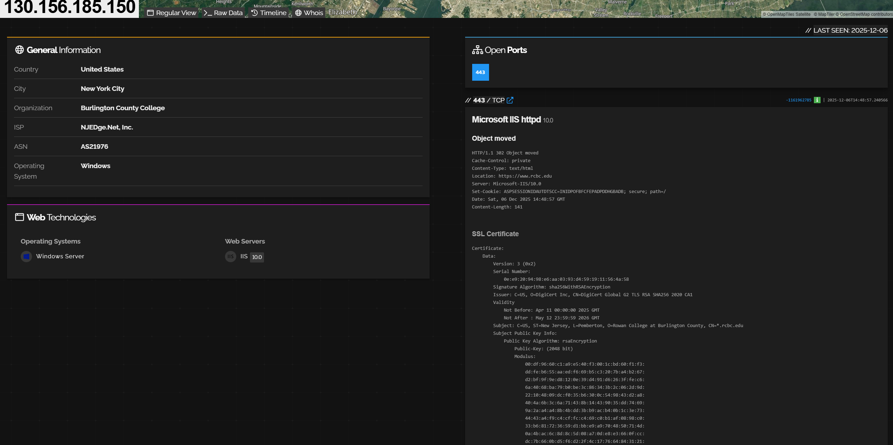
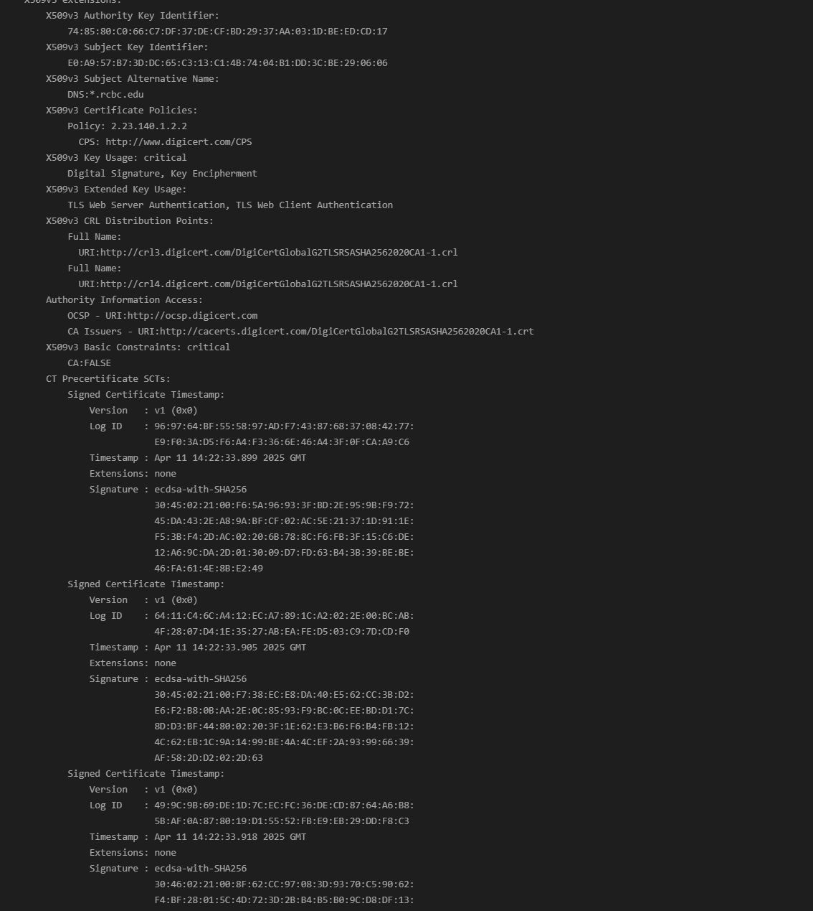

- Identified publicly exposed IP addresses
- Detected open ports such as 443/TCP
- Enumerated web server software
- Reviewed SSL/TLS certificate metadata

---

## Google Dorks

- Discovered indexed documents and PDFs
- Identified login portals and directories
- Mapped employee presence and email patterns

---

## Email Enumeration (Hunter.io)

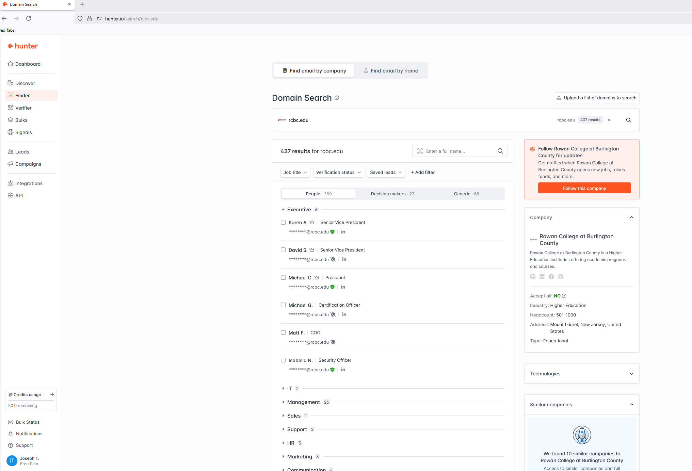

- Identified organizational email patterns
- Enumerated publicly associated email addresses
- Validated common naming conventions

---

# Module 2 — Hashing & Password Security

## Hash Generation (Linux)

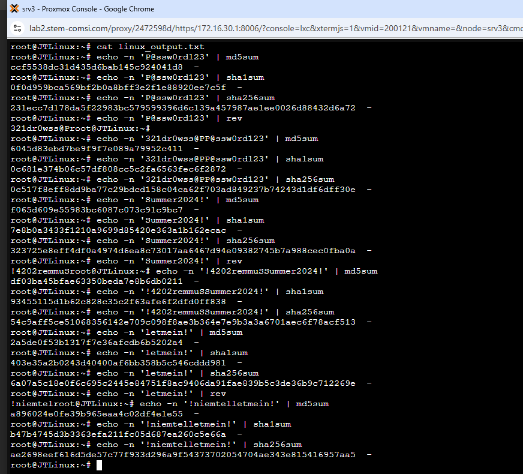

- Generated MD5, SHA-1, and SHA-256 hashes
- Demonstrated deterministic output

---

## Hashing with CyberChef

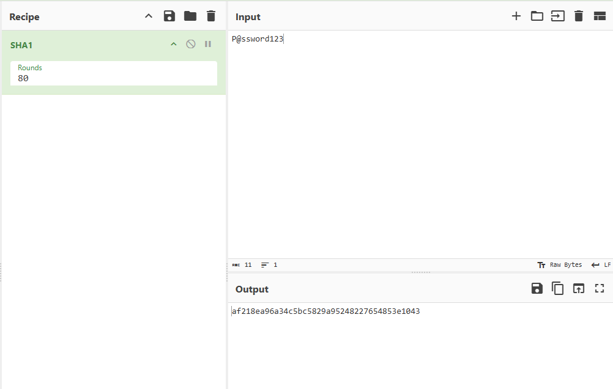
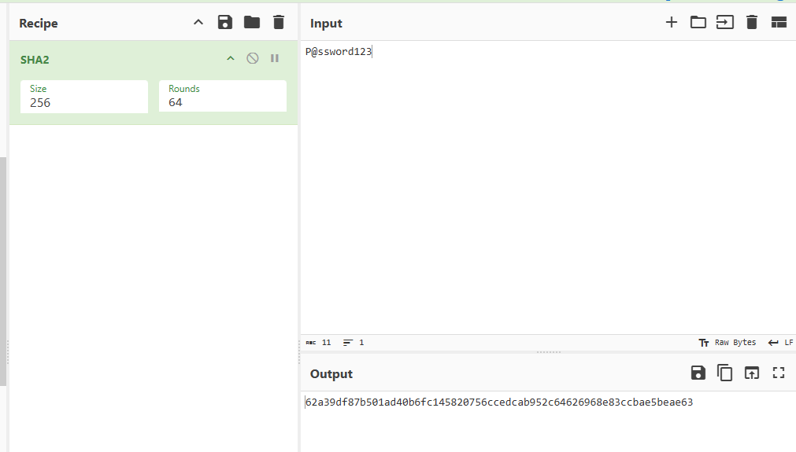

---

## Salting Demonstration

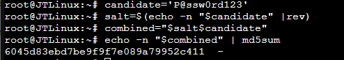

- Generated salt using reversed password
- Demonstrated impact on hash output

---

## Cracking Unsalted Hashes

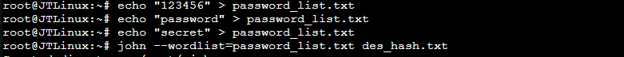

- Successfully cracked unsalted hashes
- Demonstrated weakness of fast hash algorithms

---

# Module 3 — Encryption & Integrity

## File Creation & Encryption (AES)

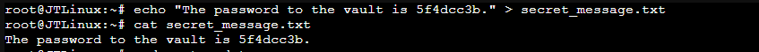
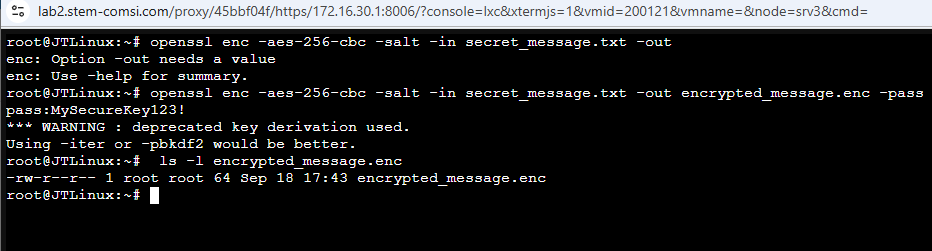

---

## Decryption Validation

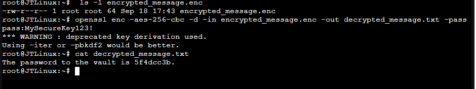

- Successfully recovered plaintext

---

## Blowfish Encryption

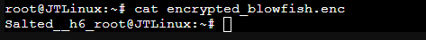

---

## DES Failure (Legacy Cipher)

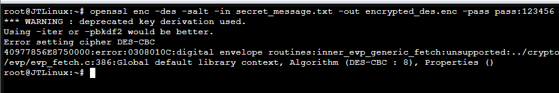

- Demonstrated deprecated encryption failure

---

## AES Decryption (CrypTool)

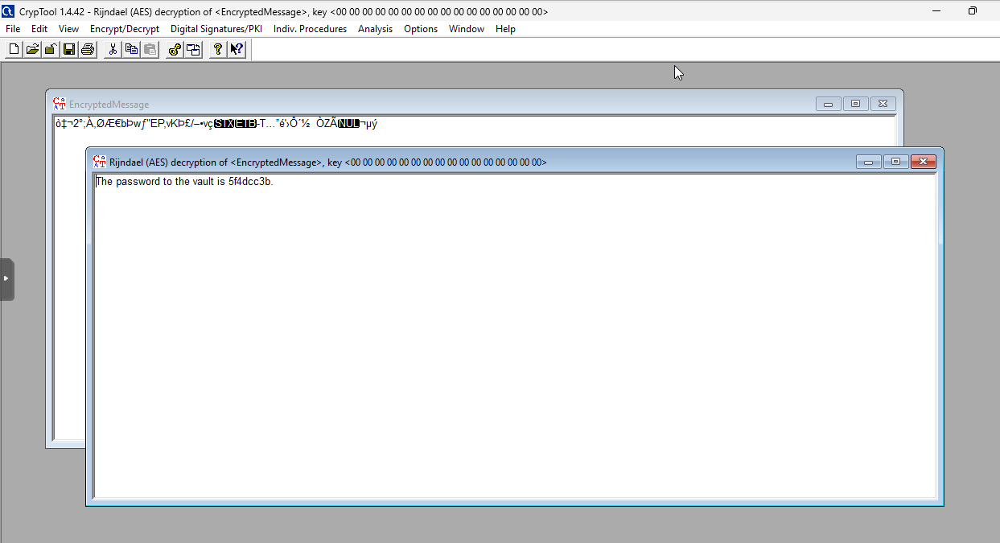

---

## Digital Signature Verification

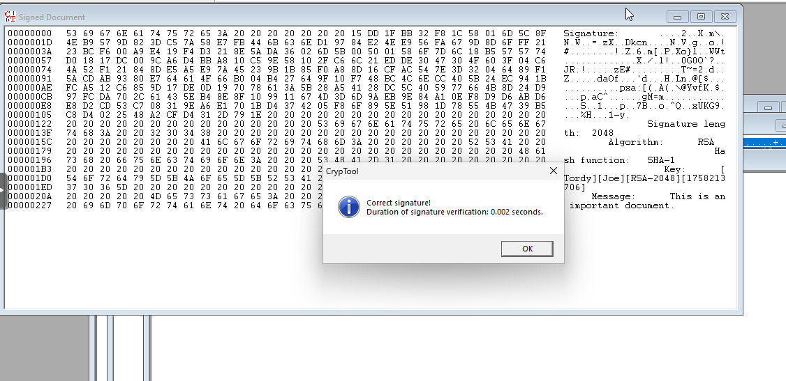

- Verified message integrity and authenticity

---

## Key Defensive Takeaways

- Public OSINT exposure expands attack surface
- Weak hashing enables rapid credential compromise
- Salts must be strong and unique
- Modern encryption is critical for confidentiality
- Legacy cryptography introduces systemic risk
- Integrity validation is essential for trust

---

## Skills Demonstrated

- Passive reconnaissance and OSINT analysis
- Cryptographic hashing and salting
- Password cracking techniques
- Encryption and decryption workflows
- Digital signature validation
- Defensive security documentation

---

## Ethical Notice

All activities were performed using publicly available information or controlled lab data. No unauthorized access or exploitation occurred.
